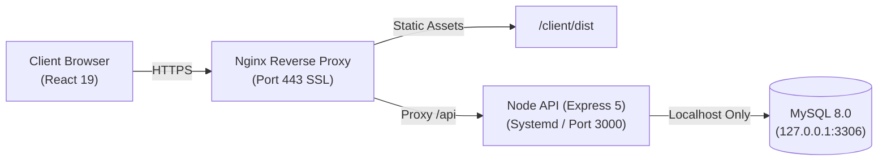

# HEAT

A personal finance and subscription tracker I built from scratch to learn real backend engineering.

**Live App:** [heat.metesirin.dev](https://heat.metesirin.dev)

Demo credentials if you wanna test it.\
_email_: <u>demo@gmail.com</u>\
_password_: <u>demo1234</u>

---

### Why I built this :

I wanted to create a fullstack project without using any BaaS like Vercel , Firebase or Supabase. It helped me understand how deployement and concepts like auth worked.

- **(No BaaS):** I wrote plain Node.js (Express 5) + raw MySQL 8 so I'd write every query, auth check, and database transaction by hand.
- **Deploying on a Linux Machine:** Instead of deploying to Vercel or Render, I rented an unmanaged Linux VPS from Hetzner and configured the whole server myself (Ubuntu 24.04, UFW firewall, Nginx reverse proxy, systemd process supervisor, and SSL with Certbot).
- **The UI:** I vibe-coded the frontend with React 19 and Tailwind CSS to have a clean, working dashboard to use and test the API with.

---

## How it's set up

---

## Key decisions & highlights

- **Auth & Security:** I chose JWTs in HTTP-only cookies to protect against XSS token theft, added a dummy bcrypt check on failed logins to prevent timing attacks, and built database timestamp checks to instantly revoke tokens on logout or password change.
- **SQL Aggregations:** I used MySQL `GROUP BY` and `SUM()` to calculate category totals directly in the database instead of dumping thousands of raw rows to the frontend.
- **VPS Hardening:** I locked down SSH with Ed25519 keys, disabled root login, set up a UFW firewall, and bound MySQL strictly to localhost so port 3306 is never exposed to the internet.

---

## Explore the project

- [**Backend & VPS Setup Deep-Dive**](server/README.md) - How the server, database queries, and Hetzner VPS are configured.
- [**API Documentation**](docs/api.md) - Endpoints, request schemas, and responses.
- [**Frontend Code**](client/README.md) - Quick notes and run commands for the UI.
