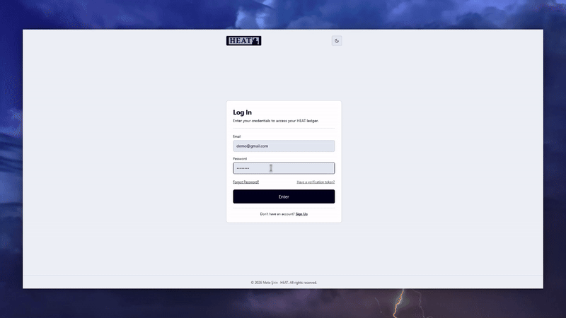
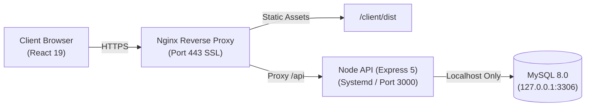

# HEAT

A personal finance and subscription tracker I built from scratch to learn real backend engineering.

**Live App:** [heat.metesirin.dev](https://heat.metesirin.dev)

Demo credentials if you wanna test it yourself.\
_email_: <u>demo@gmail.com</u>\
_password_: <u>demo1234</u>

---

## Summary

I wanted to create a fullstack project without relying on any BaaS platforms like Firebase, Supabase, or automated hosts like Vercel. Instead, I built plain Node.js with Express 5 and raw MySQL 8 so that I would write every SQL query, auth check, and database transaction by hand. Rather than deploying to a managed platform, I rented an unmanaged Linux VPS from Hetzner and configured the server environment, setting up Ubuntu 24.04, a UFW firewall, an Nginx reverse proxy, a systemd process supervisor, and automated SSL with Certbot. On the frontend, I vibe-coded, responsive dashboard using React 19 and Tailwind CSS to interact with and test the API in real time.

---

## How it's set up

---

## Highlights

For authentication and security, I used JWTs stored in HTTP cookies to protect against XSS token theft, added a dummy bcrypt check on failed logins to prevent user enumeration timing attacks, and built database timestamp checks to instantly revoke tokens on logout or password change. To keep data processing fast and lightweight, category breakdowns and analytics rely on database-level MySQL `GROUP BY` and `SUM()` aggregations instead of dumping thousands of raw rows to the frontend. At the infrastructure level, the VPS is hardened by enforcing Ed25519 SSH keys, disabling root login, configuring a strict UFW firewall, and binding MySQL exclusively to localhost so port 3306 is never exposed to the public internet.

---

## Other Files

- [**Backend & VPS**](server/README.md) - How the server, database queries, and Hetzner VPS are configured.
- [**API Documentation**](docs/api.md) - Endpoints, request schemas, and responses.
- [**Frontend Code**](client/README.md) - Quick notes and run commands for the UI.
